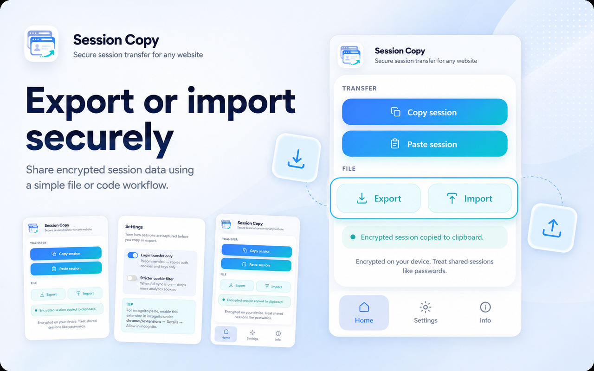
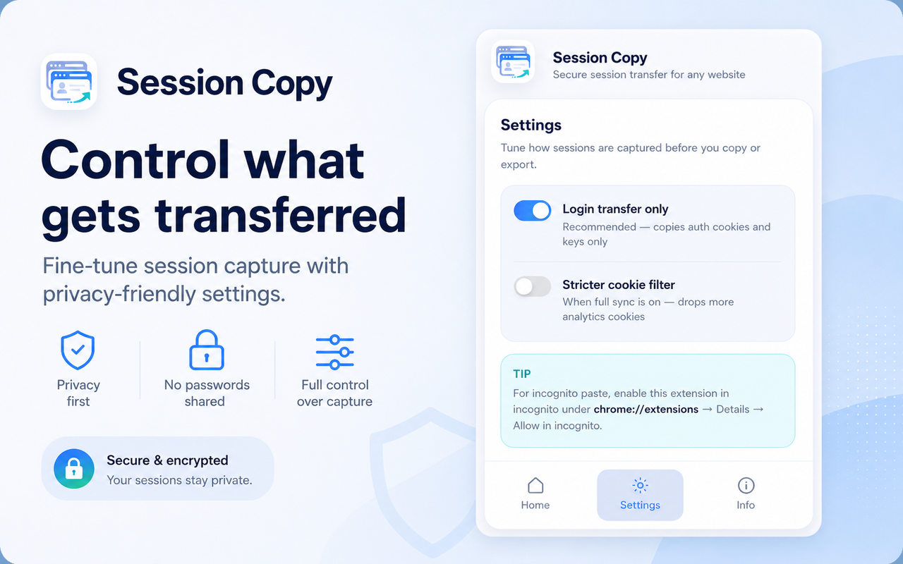
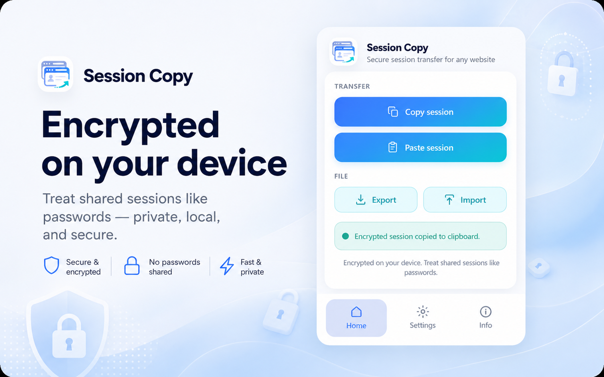

<p align="center">
  
</p>

<h1 align="center">Session Copy</h1>

<p align="center">
  <strong>Secure session transfer for any website</strong>
</p>

<p align="center">
  <a href="https://chromewebstore.google.com/detail/session-copy/cdmghcjmilmfknopnilocihmcpabblkp"><strong>Add to Chrome</strong></a>
</p>

<p align="center">
  <a href="https://chromewebstore.google.com/detail/session-copy/cdmghcjmilmfknopnilocihmcpabblkp">Chrome Web Store</a> ·
  <a href="https://makogai.github.io/session-copy/">Website</a> ·
  <a href="https://github.com/Makogai/session-copy/releases">Releases</a> ·
  <a href="https://makogai.github.io/session-copy/privacy.html">Privacy</a> ·
  <a href="https://github.com/Makogai/session-copy/issues">Issues</a>
</p>

---

**Session Copy** is a Chrome extension that copies and restores an **encrypted** snapshot of **localStorage**, **sessionStorage**, and **cookies** for the site you are on—so you can move a login session to another browser or machine. Everything is processed **on your device**; there is no cloud vault or account.

## Install

**Users:** install from the [Chrome Web Store](https://chromewebstore.google.com/detail/session-copy/cdmghcjmilmfknopnilocihmcpabblkp).

**Developers:** build from source and load the `dist/` folder — see [Development](#development) below.

## Features

- **Universal** — works on the active tab’s origin; built for any site you can log into in Chrome.
- **Encrypted by default** — session data is packed and encrypted before it leaves the browser (clipboard or `.session` file).
- **HttpOnly cookies** — restored with `chrome.cookies.set` from the service worker, not `document.cookie`.
- **Login transfer mode** — recommended default; copies auth-related keys and cookies only, not full UI state.
- **Clipboard or file** — copy/paste a token when it fits; otherwise export/import an encrypted file.
- **Clear site data** — reset cookies and storage for the active tab if a restore left the site broken.
- **Light / dark themes** — matches your system by default; switch in Settings.
- **Offline** — no analytics, no backend, no session database operated by this project.

## Screenshots

<p align="center">
  
</p>
<p align="center"><em>Copy &amp; paste, or export and import an encrypted session file</em></p>

<p align="center">
  
</p>
<p align="center"><em>Control what gets captured before you copy or export</em></p>

<p align="center">
  
</p>
<p align="center"><em>Encrypted on your device — treat shared sessions like passwords</em></p>

## How it works

1. Log in on the site you care about.
2. Open Session Copy → **Copy session** (or **Export** to save a file).
3. On another browser or machine → **Paste session** or **Import** the file.
4. If the site still looks logged out, **reload** the page once.
5. If a restore made things worse, open **Clear** (or **Site cleanup** on Home/Settings) to reset that site’s cookies and storage.

Some sites store extra state in IndexedDB or device checks; restores may be partial. See [limits](#limits) below.

## Settings

| Option | Description |
|--------|-------------|
| **Login transfer only** (default) | Copies a small allowlist of storage keys and cookies that typically carry auth. |
| **Stricter cookie filter** | When full sync is enabled, drops more analytics-style cookies. |
| **Theme** | System (default), Light, or Dark appearance for the popup. |

To paste into **incognito**, allow the extension in incognito: `chrome://extensions` → Session Copy → **Allow in incognito**.

## Limits

- **IndexedDB**, **Cache Storage**, and **Service Worker** caches are not exported.
- Cookie restore can fail for strict `__Host-` / domain rules; check the service worker console for details.
- Shared tokens and files are **bearer credentials**—anyone with them can use the session until it expires.

## Development

Requires **Node.js 20+**.

The **popup** uses **Vue 3** and **TypeScript** under `src/popup/`. The service worker and content scripts remain JavaScript modules in `src/`. `npm run build` writes `docs/version.json` for the GitHub Pages version badge.

```bash
git clone https://github.com/Makogai/session-copy.git
cd session-copy
npm install
npm run build
npm run typecheck   # optional — Vue/TS check for the popup
```

Load the extension in Chrome:

1. Open `chrome://extensions/`
2. Enable **Developer mode**
3. **Load unpacked** → select the **`dist/`** folder

| Command | Description |
|---------|-------------|
| `npm run build` | Build into `dist/` |
| `npm run dev` | Watch mode (reload extension after rebuilds) |
| `npm run package` | Release build + `release/session-copy-v*.zip` for [Chrome Web Store](docs/CHROME_WEB_STORE.md) uploads |

Source lives in `src/`; only **`dist/`** is loaded as the extension. The repo root `manifest.json` is a template (version is taken from `package.json` at build time).

Windows packaging shortcut:

```powershell
.\scripts\package-extension.ps1
```

See [docs/CHROME_WEB_STORE.md](docs/CHROME_WEB_STORE.md) for publishing updates and [docs/GITHUB_PAGES.md](docs/GITHUB_PAGES.md) for the project site.

## Privacy

See [PRIVACY.md](PRIVACY.md).

## License

[MIT](LICENSE) — Copyright (c) 2021 Lawrence Lagerlof
